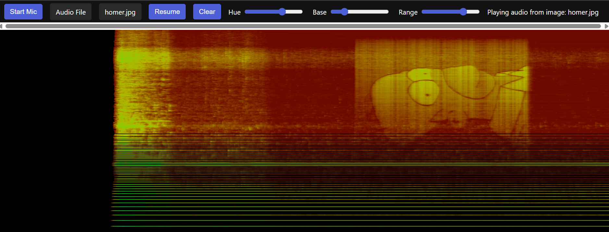

# 🎵 Image-to-Audio Spectrogram Visualizer 🎨

A real-time audio visualization tool that converts images to sound and displays spectrograms of audio from various sources (microphone, audio files, or images converted to audio).



## ✨ Features

- **🎤 Multiple Input Sources**:
  - Microphone input for real-time audio visualization
  - Audio file upload (.mp3, .wav, etc.)
  - Image-to-audio conversion with spectrogram display
  
- **📊 Real-time Visualization**:
  - Responsive spectrogram display
  - Customizable color mapping
  - Pause/resume functionality
  
- **📱 Responsive Design**:
  - Works on both desktop and mobile devices
  - Adaptive interface with hamburger menu on small screens
  
- **🖼️ Image Processing**:
  - Server-side image-to-audio conversion
  - Uses the 'enscribe' command-line tool
  - Supports common image formats (JPEG, PNG, GIF)

## 🚀 Installation

### Prerequisites

- 🖥️ Web server with PHP support
- 🛠️ 'enscribe' command-line tool installed on the server
- 🌐 Modern web browser with Web Audio API support

### Setup

1. Clone this repository:
   ```bash
   git clone https://github.com/yourusername/image-to-audio-spectrogram.git
   cd image-to-audio-spectrogram
   ```

2. Create required directories:
   ```bash
   mkdir uploads
   mkdir audio
   ```

3. Set proper permissions:
   ```bash
   chmod 755 uploads
   chmod 755 audio
   ```

4. Make sure PHP has permission to execute the 'enscribe' command.

5. Deploy to your web server or run locally with PHP's built-in server:
   ```bash
   php -S localhost:8000
   ```

## 🎮 Usage

1. Open the application in your web browser.

2. Choose an input source:
   - **🎤 Microphone**: Click "Start Mic" to use your device's microphone
   - **🎧 Audio File**: Upload an audio file using the "Audio File" button
   - **🖼️ Image File**: Upload an image to convert to audio using the "Image File" button

3. Adjust visualization parameters:
   - **🌈 Hue**: Changes the color spectrum used in the visualization
   - **☀️ Base**: Adjusts the base brightness level
   - **📊 Range**: Controls the dynamic range of brightness

4. Additional controls:
   - **⏯️ Pause/Resume**: Freezes or continues the visualization
   - **🧹 Clear**: Resets the visualization display

## ⚙️ How It Works

### Client-Side

The web application uses the Web Audio API to:
- Capture audio from the microphone
- Process audio files
- Analyze frequency data using an FFT analyzer
- Visualize the frequency spectrum as a scrolling spectrogram

### Server-Side

The PHP handler (`enscribe_handler.php`):
1. Receives uploaded images
2. Validates file types and sizes
3. Executes the 'enscribe' command to convert images to audio
4. Returns the path to the generated audio file

## 🔬 Technical Details

- The spectrogram visualizes frequency data from 0Hz to ~22kHz (depending on sample rate)
- Frequency data is mapped logarithmically for more natural audio visualization
- The Web Audio API's AnalyserNode performs real-time FFT analysis
- Color mapping uses HSL color space for intuitive parameter control

## 🔒 Security Considerations

- File validation prevents upload of unauthorized file types
- Command execution is protected against injection using `escapeshellcmd()` and `escapeshellarg()`
- File size limits prevent server resource abuse

## 🔧 Troubleshooting

- **🔇 No audio visualization**: Ensure your browser supports the Web Audio API
- **🎤 Microphone access denied**: Check browser permissions for microphone access
- **🖼️ Image processing fails**: Verify the 'enscribe' command is properly installed and accessible to PHP
- **📱 Blank display on mobile**: Try rotating your device or refreshing the page

## 🌐 Browser Compatibility

- Chrome 70+
- Firefox 63+
- Safari 12.1+
- Edge 79+

## 📄 License

[MIT License](LICENSE)

## 👏 Acknowledgments

- The 'enscribe' tool for image-to-audio conversion
- Web Audio API for real-time audio processing capabilities
